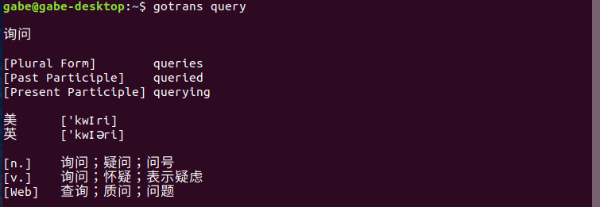
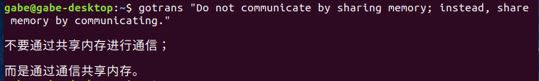
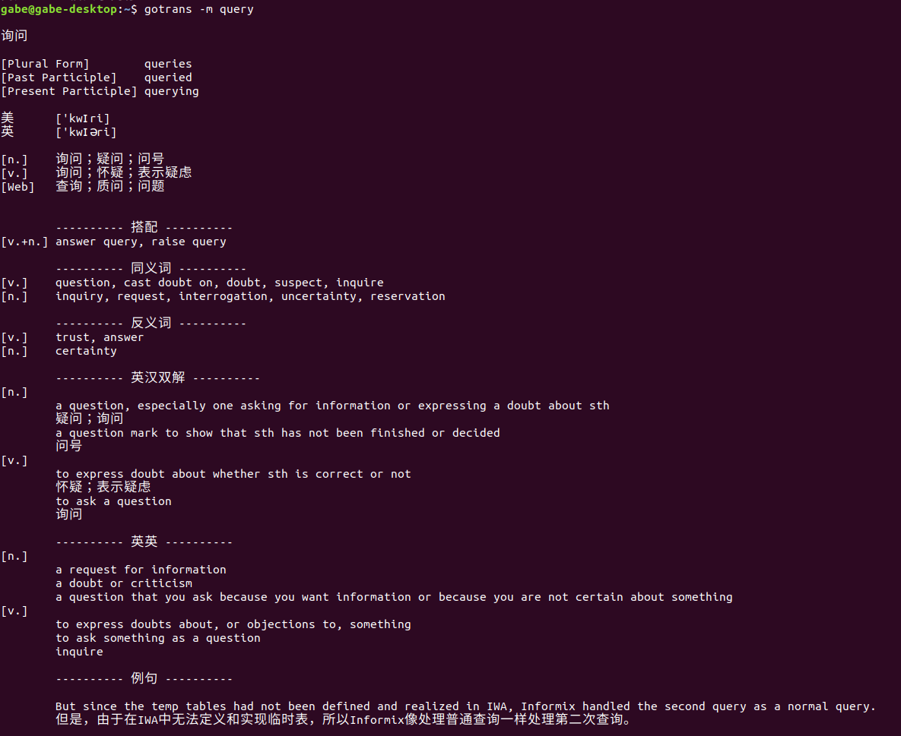

# gotrans

命令行翻译工具

## 翻译系列自用项目

- 后端翻译服务（smart-translator）： https://github.com/fishjar/smart-translator
- 谷歌浏览器翻译插件（mihuan-translate）： https://github.com/fishjar/mihuan-translate
- VSCODE 翻译插件（vscode-translate）： https://github.com/fishjar/vscode-translate
- 命令行翻译（gotrans）： https://github.com/fishjar/go-translate

## 使用说明

```sh
# 安装
go install

# 翻译单词
gotrans query

# 详细的单词解释
gotrans -m query

# 翻译句子
gotrans "Do not communicate by sharing memory; instead, share memory by communicating."

# 多行句子
gotrans \
"Do not communicate by sharing memory;" \
"instead, share memory by communicating."
```

## 截图

### 单词



### 句子



### 单词（详细）


